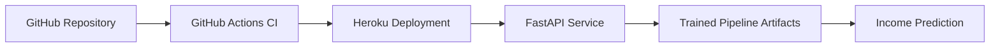

# Census Income Classification API

[](https://www.python.org/)
[](https://fastapi.tiangolo.com/)
[](https://census-income-api-7cfe90f1b0a4.herokuapp.com/health)
[](https://census-income-api-7cfe90f1b0a4.herokuapp.com/health)

End-to-end MLOps project for the UCI Adult Census Income dataset. The project
trains a binary classification model to predict whether an individual's income
is greater than `50K` and exposes the prediction service through a FastAPI API.

Repository: [FabioCLima/Census-Income-Project](https://github.com/FabioCLima/Census-Income-Project)

## Project Overview

This repository covers the core stages of an applied MLOps workflow:

- data ingestion and preprocessing
- model training and persistence
- slice-based performance analysis
- API serving with FastAPI
- automated tests for model and API behavior
- CI/CD support through GitHub Actions

## Architecture



## Tech Stack

- Python `>=3.13`
- FastAPI
- scikit-learn
- pandas
- joblib
- pytest
- Ruff
- uv

## Repository Structure

- `src/census/` - dataset schema, preprocessing, model utilities, and slicing logic
- `main.py` - FastAPI application entrypoint
- `train_model.py` - training script for generating model artifacts
- `tests/` - automated tests for model code and API routes
- `model/` - trained artifacts and slice analysis outputs
- `model_card.md` - model card documenting the trained system
- `notebooks/` - exploratory analysis and bias study notebooks
- `.github/workflows/ci.yml` - GitHub Actions workflow for continuous integration

## Setup

Create and activate a virtual environment, then install the project
dependencies.

```bash
python3 -m venv .venv
source .venv/bin/activate
pip install uv
uv sync --all-groups
```

## Train The Model

Run the training pipeline to generate the serialized model artifacts used by the
API.

```bash
python train_model.py
```

Expected outputs are written under `model/`.

## Run The API Locally

Start the FastAPI application with Uvicorn:

```bash
uv run uvicorn main:app --reload
```

Once the server is running, the API is available at `http://127.0.0.1:8000`.

## API Endpoints

- `GET /` returns a basic health response
- `GET /health` returns `{"status": "ok"}` for uptime/readiness checks
- `POST /predict` accepts a JSON payload with the expected census features and
  returns an income prediction

Example local request:

```bash
curl -X POST "http://127.0.0.1:8000/predict" \
  -H "Content-Type: application/json" \
  -d '{
    "age": 37,
    "workclass": "Private",
    "fnlwgt": 34146,
    "education": "Bachelors",
    "education-num": 13,
    "marital-status": "Married-civ-spouse",
    "occupation": "Exec-managerial",
    "relationship": "Husband",
    "race": "White",
    "sex": "Male",
    "capital-gain": 0,
    "capital-loss": 0,
    "hours-per-week": 40,
    "native-country": "United-States"
  }'
```

## Run The Test Suite

Run the automated tests with:

```bash
uv run pytest
```

If you also want linting:

```bash
uv run ruff check .
uv run ruff format --check .
```

## Model Documentation

Additional project documentation is available in:

- `model_card.md` for model-level documentation
- `docs/rubrica.md` for rubric alignment
- `docs/census_income_project_sprint_guide.md` for project guidance

## Fairness Snapshot

The project includes slice-based evaluation and an Aequitas bias study covering
`sex` and `race`. In the current documented run, `Female` and `Black` show
disparity values outside the screening band `[0.8, 1.25]`, which indicates
bias risk that should be monitored before any deployment-like use.

This model is for educational MLOps purposes and should not be used for
sensitive real-world decisions. See [`model_card.md`](model_card.md) for the
full bias assessment tables and interpretation.

## Deployment And CI

The repository includes GitHub Actions configuration in
`.github/workflows/ci.yml` to automate code quality checks and project
validation. This helps ensure the application is tested before promotion across
branches or deployment targets.

Live API:

- Base URL: `https://census-income-api-7cfe90f1b0a4.herokuapp.com`
- Health check: `https://census-income-api-7cfe90f1b0a4.herokuapp.com/health`
